# DevSkill Tracker — System Architecture Diagram

```mermaid
graph TB
    %% ─────────────────────────────────────────────
    %% USERS
    %% ─────────────────────────────────────────────
    Student["🧑‍💻 Student / Developer"]
    Admin["👤 Admin"]

    %% ─────────────────────────────────────────────
    %% CLIENT LAYER
    %% ─────────────────────────────────────────────
    subgraph Clients["Client Layer"]
        subgraph Ext["VS Code Extension  (TypeScript)"]
            TrackSvc["TrackingService\n⏱ 30 s heartbeat"]
            AuthSvc["AuthService"]
            APISvc["APIService"]
        end

        subgraph Web["React Web App  (Vercel · Vite + TailwindCSS)"]
            AuthCtx["AuthContext\n(Firebase JS SDK)"]
            Dashboard["Dashboard & Analytics\n(Recharts)"]
            QuestUI["Quest Interface\n(Monaco Editor)"]
            AdminPanel["Admin Panel"]
        end
    end

    %% ─────────────────────────────────────────────
    %% BACKEND LAYER
    %% ─────────────────────────────────────────────
    subgraph Backend["Backend — FastAPI · Python 3.13  (Hugging Face Spaces · Docker)"]
        subgraph Routes["API Routes"]
            SessAPI["Session API\n/session/start  /update  /end"]
            QuestAPI["Quest API\n/quests/daily  /quests/complete"]
            AnalyzeAPI["Analyze API\n/analyze  /detect-ai"]
            AdminAPI["Admin API\n/admin/quests  CRUD + seed"]
        end

        subgraph ML["ML Engine"]
            CodeBERT["CodeBERT Classifier\nSkill Level Detection\n(fine-tuned · HF Hub)"]
            AIEngine["AI Detection Engine\n8 Behavioral Signals\n(typing speed · paste ratio\nrhythm · deletions · bursts\nCopilot · undo/redo · idle)"]
            SKLearn["scikit-learn\nKeyword Classifier\n(fallback)"]
        end

        QuestGen["Quest Generator\n(Groq Llama 3.3 / Anthropic Claude)\nPersonalized · Adaptive difficulty"]
    end

    %% ─────────────────────────────────────────────
    %% DATA & AUTH LAYER
    %% ─────────────────────────────────────────────
    subgraph DataLayer["Data & Auth Layer  (Google Cloud)"]
        subgraph Firestore["Google Cloud Firestore  (NoSQL)"]
            UsersCol[("users")]
            SessionsCol[("sessions\n· keystroke metrics\n· AI likelihood score\n· skill level")]
            QuestsCol[("quests\n· title · task · xp\n· testCases[]")]
            MetaCol[("student_quest_meta\n· difficultyScore\n· recentPerformance[]")]
        end

        FireAuth["Firebase Authentication\nEmail / Password + JWT\n(session-only persistence)"]
    end

    %% ─────────────────────────────────────────────
    %% EXTERNAL SERVICES
    %% ─────────────────────────────────────────────
    subgraph External["External AI & Model Services"]
        HFHub["🤗 Hugging Face Hub\nHannan-12/devskill-codebert\n(cold-start download)"]
        GroqAPI["Groq API\nLlama 3.3-70B\n(quest gen · classification)"]
        AnthropicAPI["Anthropic Claude API\n(quest personalization)"]
    end

    %% ─────────────────────────────────────────────
    %% CI / CD
    %% ─────────────────────────────────────────────
    subgraph CICD["CI / CD  (GitHub Actions)"]
        VercelCI["Vercel\nAuto-deploy on main push"]
        HFSpacesCI["HF Spaces Docker\ndeploy-backend.sh / workflow"]
        ExtCI["Extension Build\n.vsix on ext-v* tag"]
    end

    %% ─────────────────────────────────────────────
    %% EDGES — User → Clients
    %% ─────────────────────────────────────────────
    Student -->|"codes in VS Code"| Ext
    Student -->|"views analytics & quests"| Web
    Admin -->|"manages quest pool"| AdminPanel

    %% ─────────────────────────────────────────────
    %% EDGES — Extension → Backend
    %% ─────────────────────────────────────────────
    TrackSvc -->|"POST /session/start\nPUT /session/{id}/update\nPOST /session/{id}/end"| SessAPI
    AuthSvc <-->|"sign-in / token refresh"| FireAuth
    APISvc --> SessAPI

    %% ─────────────────────────────────────────────
    %% EDGES — Frontend → Backend
    %% ─────────────────────────────────────────────
    AuthCtx <-->|"sign-in / sign-out"| FireAuth
    Dashboard -->|"GET session history"| SessAPI
    QuestUI -->|"GET /quests/daily\nPOST /quests/complete"| QuestAPI
    QuestUI -->|"POST /analyze\n(Monaco editor code)"| AnalyzeAPI
    AdminPanel -->|"GET / POST / PUT / DELETE"| AdminAPI

    %% ─────────────────────────────────────────────
    %% EDGES — Backend internal
    %% ─────────────────────────────────────────────
    SessAPI --> CodeBERT
    SessAPI --> AIEngine
    AnalyzeAPI --> CodeBERT
    AnalyzeAPI --> AIEngine
    CodeBERT -.->|"keyword fallback"| SKLearn
    QuestAPI --> QuestGen

    %% ─────────────────────────────────────────────
    %% EDGES — Backend → Firestore
    %% ─────────────────────────────────────────────
    SessAPI -->|"read / write"| SessionsCol
    SessAPI -->|"read"| UsersCol
    QuestAPI -->|"read / write"| QuestsCol
    QuestAPI -->|"read / write"| MetaCol
    AdminAPI -->|"CRUD"| QuestsCol

    %% ─────────────────────────────────────────────
    %% EDGES — ML → External APIs
    %% ─────────────────────────────────────────────
    CodeBERT -->|"model weights download"| HFHub
    CodeBERT -->|"LLM classification fallback"| GroqAPI
    QuestGen -->|"quest generation"| GroqAPI
    QuestGen -->|"personalization"| AnthropicAPI

    %% ─────────────────────────────────────────────
    %% EDGES — CI/CD
    %% ─────────────────────────────────────────────
    VercelCI -->|"deploys"| Web
    HFSpacesCI -->|"builds & deploys"| Backend
    ExtCI -->|"publishes"| Ext

    %% ─────────────────────────────────────────────
    %% STYLES
    %% ─────────────────────────────────────────────
    classDef user       fill:#4A90D9,stroke:#2C5F8A,color:#fff,font-weight:bold
    classDef client     fill:#6C8EBF,stroke:#4A6FA5,color:#fff
    classDef backend    fill:#82B366,stroke:#5A8A44,color:#fff
    classDef ml         fill:#D6B656,stroke:#A8893A,color:#333
    classDef data       fill:#D79B00,stroke:#A07300,color:#fff
    classDef external   fill:#9673A6,stroke:#6E4F8A,color:#fff
    classDef cicd       fill:#AE4132,stroke:#7D2E22,color:#fff
    classDef collection fill:#FFF2CC,stroke:#D6B656,color:#333

    class Student,Admin user
    class TrackSvc,AuthSvc,APISvc,AuthCtx,Dashboard,QuestUI,AdminPanel client
    class SessAPI,QuestAPI,AnalyzeAPI,AdminAPI backend
    class CodeBERT,AIEngine,SKLearn,QuestGen ml
    class FireAuth data
    class UsersCol,SessionsCol,QuestsCol,MetaCol collection
    class HFHub,GroqAPI,AnthropicAPI external
    class VercelCI,HFSpacesCI,ExtCI cicd
```



## Component Summary

| Component | Technology | Host |
|---|---|---|
| VS Code Extension | TypeScript, Firebase JS SDK | Local / GitHub Releases |
| React Web App | React 19, Vite, TailwindCSS, Recharts | Vercel |
| FastAPI Backend | Python 3.13, FastAPI, PyTorch, Transformers | Hugging Face Spaces (Docker) |
| Skill Classifier | Fine-tuned CodeBERT (`Hannan-12/devskill-codebert`) | HF Spaces (loaded from HF Hub) |
| AI Detection Engine | Physics-based 8-signal behavioral analysis | HF Spaces (in-process) |
| Quest Generator | Groq Llama 3.3 + Anthropic Claude | External API calls |
| Database | Google Cloud Firestore (NoSQL) | Google Cloud |
| Authentication | Firebase Authentication (Email/Password + JWT) | Google Cloud |
| CI/CD | GitHub Actions | GitHub |

## Key Data Flows

### 1. Live Coding Tracking (Extension)
```
Developer codes in VS Code
  → TrackingService collects keystrokes, pastes, edits, typing intervals
  → POST /session/start  (creates Firestore session doc)
  → PUT /session/{id}/update  every 30 s  (syncs metrics)
  → POST /session/{id}/end  on stop/close
      ├─ CodeBERT → skill level (Beginner / Intermediate / Advanced)
      ├─ AIDetectionEngine → AI likelihood score 0–100
      └─ Results stored in Firestore sessions collection
```

### 2. Adaptive Quest Learning (Frontend)
```
Student opens Quest page
  → GET /quests/daily/{userId}
      ├─ Backend queries user context (skill level, weak areas, undo/paste ratios)
      └─ Groq Llama 3.3 generates 10 quests
          (5 reinforcement · 3 stretch · 2 weak-area)
  → Student writes solution in Monaco Editor
  → POST /analyze  (code snapshot)
      ├─ CodeBERT classifies skill
      ├─ testCase validation (pattern match / execution)
      └─ AIDetectionEngine scores submission
  → POST /quests/complete  (updates difficultyScore ±1–2)
```

### 3. AI Detection Signals
| Signal | AI Pattern | Human Pattern |
|---|---|---|
| Typing speed (kpm) | Fast, constant | Variable |
| Paste ratio | High | Low |
| Typing rhythm (IKI) | Uniform | Bursty |
| Deletion ratio | Low | High |
| Burst patterns | Few confident bursts | Many small bursts |
| Copilot accepts | High | Mixed |
| Undo/redo ratio | Low | High |
| Idle ratio | Low | High (thinking) |
